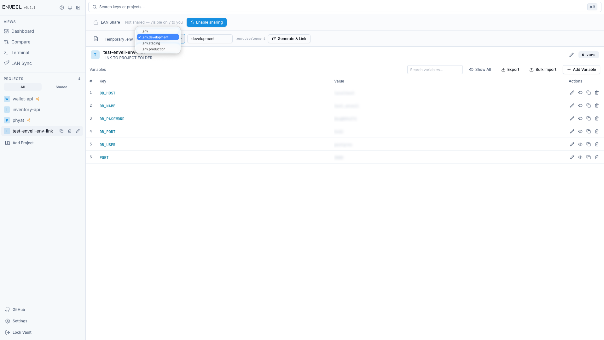
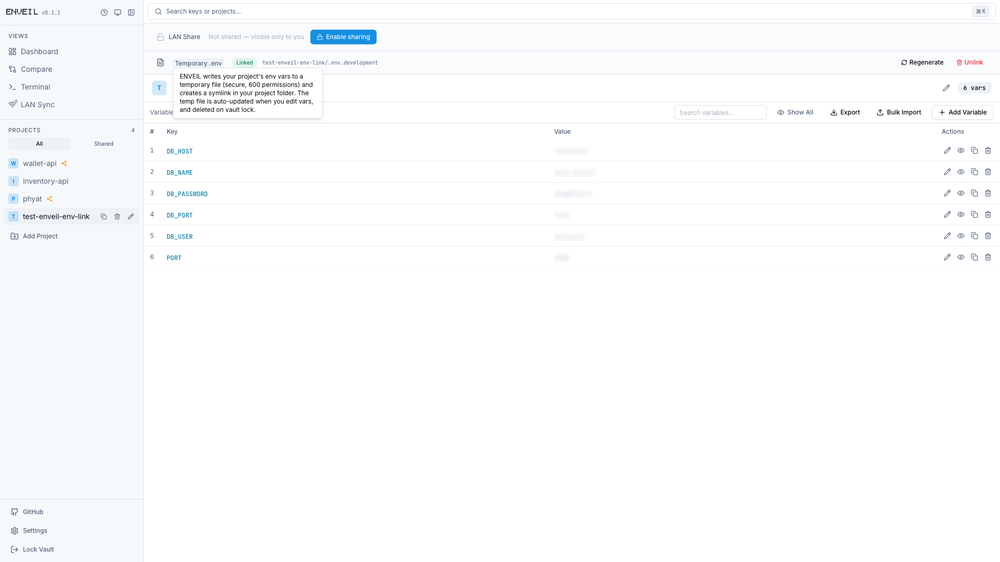
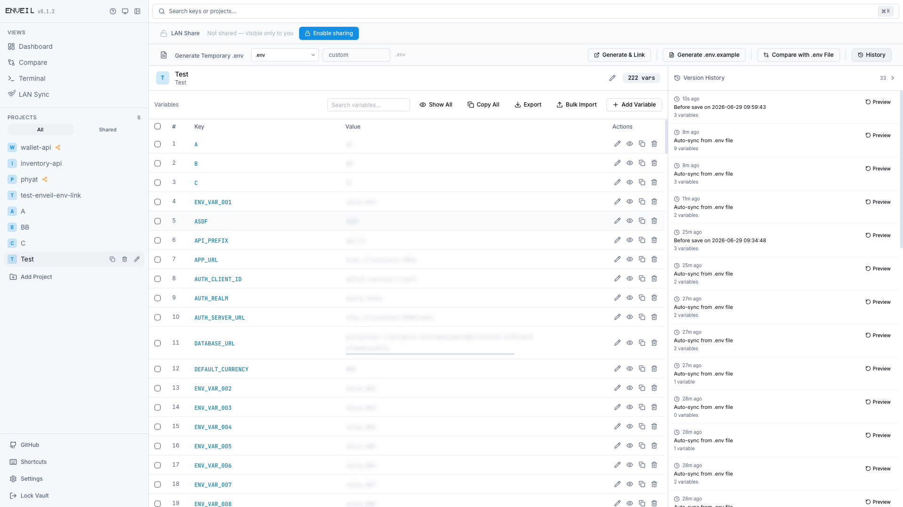
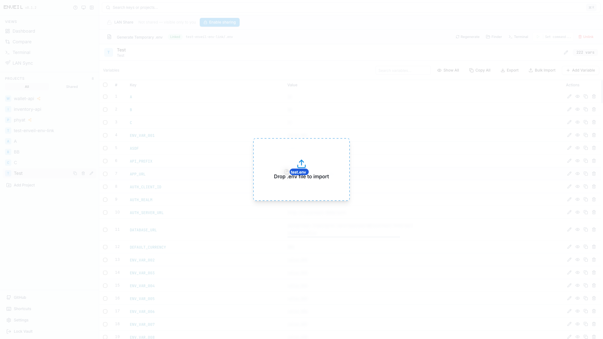
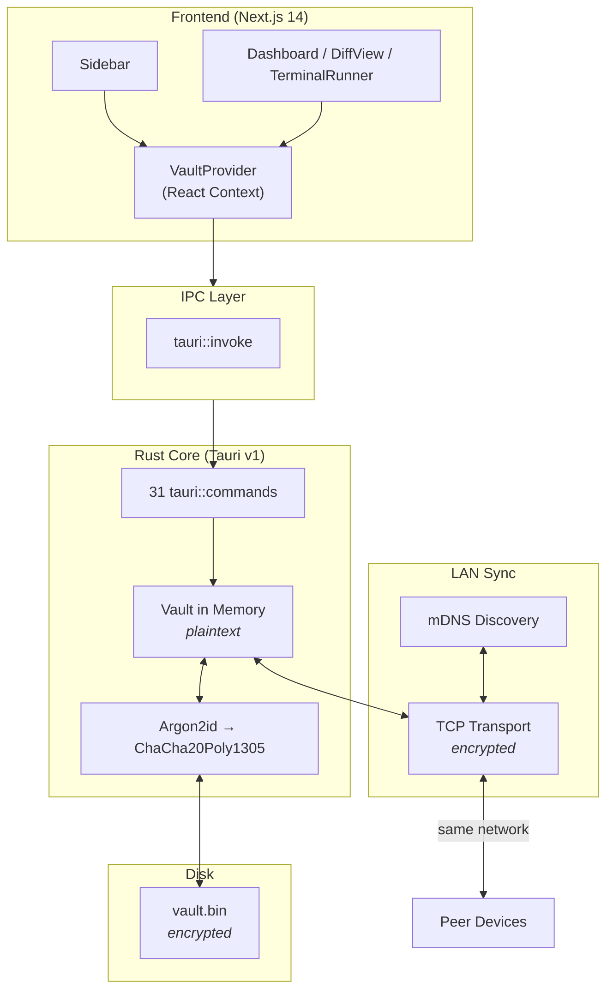
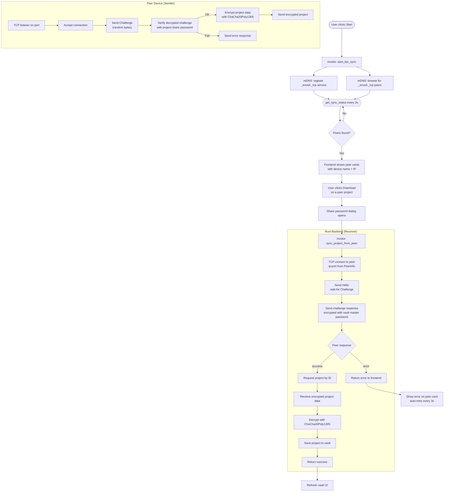

# ENVEIL — Centralized .env & Secret Vault

A desktop application for securely managing environment variables and secrets across multiple projects. Built with **Tauri v1** (Rust backend) + **Next.js 14** (TypeScript frontend).

<p align="center">
  <a href="https://github.com/kyawsoe-dev/enveil/releases/latest">
    
  </a>
  <a href="https://github.com/kyawsoe-dev/enveil/releases/latest">
    
  </a>
  <a href="https://github.com/kyawsoe-dev/enveil/releases/latest">
    
  </a>
</p>

<p align="center">
  
  
</p>

## Download

Grab the latest installer for your platform from the [releases page](https://github.com/kyawsoe-dev/enveil/releases/latest) (`.dmg` for macOS, `.msi` for Windows, `.deb` for Linux).

### macOS Troubleshooting

If macOS blocks the app from opening (unverified developer), run this in Terminal:

```bash
xattr -cr /Applications/ENVEIL.app
```

This removes the quarantine attribute. Then open the app normally.

## Screenshots

| Dashboard | Env Table | Diff View | Terminal Runner |
|---|---|---|---|
|  |  |  |  |
| **LAN Sync** | **LAN Download** | **Settings** | **Usage Guide** |
|  |  |  |  |
| **Temp .env (before)** | **Temp .env (after)** | **Env Version History** | **Drag & Drop Import** |
|  |  |  |  |

## Features

### Vault & Security

- **Encrypted Vault** — Master password → Argon2id → ChaCha20Poly1305 encrypted `vault.bin` on disk
- **Change Password** — Re-encrypts entire vault with a new master password
- **Auto-Lock** — Lock vault after configurable inactivity timeout; running processes auto-stop on lock
- **Reset Vault** — Securely wipe the entire vault and all projects
- **Vault Backup & Restore** — Export to `.vault` file and restore with Merge or Replace mode

### Project Management

- **Project CRUD** — Create, edit, rename, delete projects with a key-value env map
- **Project Duplicate** — Duplicate existing projects with all env vars intact
- **Search** — Cmd+K search across project names, env keys, and env values
- **Dashboard Analytics** — Stats cards + bar chart ranking projects by env var count

### Environment Variables

- **Inline Env Editing** — Add, edit, bulk import, and delete env vars per project
- **Multi-Select Bulk Ops** — Checkbox + Shift-click range selection + floating action bar for batch delete/copy
- **Export / Copy All** — Export as `.env` file or copy all `KEY=VALUE` lines at once
- **Drag & Drop Import** — Drop `.env` files or paste content onto the table; conflict dialog for existing keys
- **.env.example Generation** — Generate `.env.example` from current project's env var keys

### Sync & Integration

- **Temp .env File** — Secure (600 perms) temp `.env` in `/tmp`, symlinked into your project folder. Auto-updated on edit, auto-deleted on vault lock
- **.env Auto-Sync** — Editing the linked `.env` file syncs changes back to the vault with auto-created history snapshots
- **LAN Sync** — Share projects with teammates on the same local network with per-project share passwords
- **Open Folder / Terminal** — Open a project's linked folder in Finder and Terminal with one click

### AI Assistant

- **AI Chat** — Floating chat bubble with messages, animated typing indicator, draggable position
- **AI Env Template Generation** — Describe your stack and get a structured `.env` template; preview, select, and merge into any project
- **AI Value Validation** — Validate env var values for security issues (empty values, placeholder patterns, default DB passwords, localhost URLs)
- **AI Env Docstrings** — Auto-generate one-line descriptions for every env var; shown as dotted-underline hover tooltips
- **AI Diff Summaries** — Get a plain-English summary explaining what changed between history snapshots
- **AI Suggestions** — Suggest project name/description or env var key/value from a rough description; respects existing keys
- **Rate Limiting** — 100 AI requests per day per user (counter, resets daily)
- **Offline Detection** — All AI buttons auto-disable when the device is offline

### Developer Tools

- **Terminal Runner** — Run shell commands with decrypted env vars injected — streaming output, Stop, Kill by port, command history, per-project cwd
- **Project Run Command** — Save a run command (e.g. `npm start`) and launch it from the linked toolbar with one click
- **Project Diff** — Side-by-side comparison of any two projects or against a `.env` file; swap A/B, toggle identical keys, Apply vault-to-file or file-to-vault
- **Env Var Version History** — Auto-snapshots on every save; browse history with diff preview; restore any snapshot
- **Process Group Isolation** — Kill/Stop terminates all child processes — no orphaned `node`/`npm` processes

### Dashboard Analytics

- **Security Score** — Circular gauge (0–100%) with inline Review list showing every flagged variable by project, key, and reason
- **Vault Stats** — Total Projects, Total Variables, Unique Keys, Shared Projects, AI Rate Limit remaining
- **Projects by Variable Count** — Vertical bar chart; click a bar to navigate to that project
- **Most Common Variable Names** — Top 10 most frequent keys with frequency bars
- **Coverage Gaps** — Projects missing common keys (e.g. `DATABASE_URL`, `NODE_ENV`)
- **Key Categories (by prefix)** — Auto-categorized chips (e.g. `DATABASE_*`, `REDIS_*`, `API_*`)
- **Missing Critical Vars** — Detects missing essential keys across all projects
- **Duplicate Values** — Same value used across different keys/projects
- **Change Velocity** — Snapshots per week/month per project with horizontal bar chart
- **Stale Projects** — No changes in the last 30 days
- **Recent Changes** — Recent snapshots across all projects with relative timestamps

### UI & UX

- **Dark/Light/System Theme** — Class-based theming via `next-themes`
- **Multi-Select Bulk Ops** — Checkbox + Shift-click range selection + floating action bar
- **Drag & Drop Import** — Drop `.env` files or paste content onto the table with conflict resolution
- **Keyboard Shortcuts** — `Cmd+K` search, `↑/↓` command history, `Ctrl+L` clear terminal, `Esc` clear selection
- **Resizable Sidebar** — Drag the right edge to adjust width (180–400px, persisted)
- **Custom context menu disabled** — Right-click disabled on app window
- **Beforeunload warning** — Warns before closing with unlocked vault
- **Scrollbar Styling** — Custom thin scrollbars
- **Custom Fonts** — Bitcount Single (brand), Inter (UI), JetBrains Mono (code)
- **CSS Tooltips** — Hover tooltips on Apply buttons in DiffView

## Architecture

```
┌──────────────────────────────────┐
│         Frontend (Next.js)       │
│  ┌─────────┐ ┌────────────────┐  │
│  │ Sidebar │ │ Dashboard /    │  │
│  │ (nav)   │ │ DiffView /     │  │
│  │         │ │ TerminalRunner │  │
│  └─────────┘ └────────────────┘  │
│  ┌────────────────────────────┐  │
│  │   VaultProvider (context)  │  │
│  └────────────────────────────┘  │
└──────────────┬───────────────────┘
               │ IPC (tauri::invoke)
┌──────────────▼───────────────────┐
│         Rust Core (Tauri)        │
│  ┌────────────────────────────┐  │
│  │  31 tauri::commands          │  │
│  └──────────┬─────────────────┘  │
│  ┌──────────▼─────────────────┐  │
│  │  Vault in memory (plain)   │  │
│  │  ┌──────────────────────┐  │  │
│  │  │ Argon2id → Key       │  │  │
│  │  │ ChaCha20Poly1305     │  │  │
│  │  └──────────────────────┘  │  │
│  └──────────┬─────────────────┘  │
│  ┌──────────▼─────────────────┐  │
│  │  vault.bin (disk, enc.)    │  │
│  └────────────────────────────┘  │
└──────────────────────────────────┘
```

## Flow Chart



## LAN Sync Flow



## Project Structure

```
├── desktop/                          Next.js 14 frontend
│   ├── src/
│   │   ├── app/
│   │   │   ├── layout.tsx            Root layout, metadata, font loading
│   │   │   ├── page.tsx              AppShell (sidebar + content routing)
│   │   │   └── globals.css           Tailwind base + custom CSS vars
│   │   ├── components/
│   │   │   ├── ui/                   shadcn-style primitives
│   │   │   │   ├── badge.tsx, button.tsx, card.tsx, dialog.tsx
│   │   │   │   ├── input.tsx, separator.tsx, toast.tsx, toaster.tsx
│   │   │   ├── AIChatWidget.tsx      Floating AI chat bubble
│   │   │   ├── AITemplateDialog.tsx  AI env template generation
│   │   │   ├── AppBrand.tsx          Logo/wordmark component
│   │   │   ├── ChangePasswordDialog.tsx
│   │   │   ├── Dashboard.tsx         Analytics + Security Score + env table view
│   │   │   ├── DeleteProjectDialog.tsx  Delete project confirmation
│   │   │   ├── DiffView.tsx          Side-by-side project comparison
│   │   │   ├── EditProjectDialog.tsx Add/edit project dialog
│   │   │   ├── EnvTable.tsx          Inline env var editing + AI validate/docstrings + bulk import/export
│   │   │   ├── HistoryPanel.tsx      Version history + AI diff summarization
│   │   │   ├── MasterAuth.tsx        Login/create vault screen
│   │   │   ├── ProjectView.tsx       Selected project detail view
│   │   │   ├── ResetVaultDialog.tsx  Wipe vault confirmation
│   │   │   ├── SearchBar.tsx         Cmd+K search across all data
│   │   │   ├── SettingsDialog.tsx    Vault settings (auto-lock, security, clipboard timeout)
│   │   │   ├── Sidebar.tsx           Project list + collapse + theme toggle + AI project suggest
│   │   │   ├── TerminalRunner.tsx    Shell command runner with env injection
│   │   │   ├── ThemeProvider.tsx     next-themes wrapper
│   │   │   ├── UsageGuide.tsx        Help modal
│   │   │   └── VaultProvider.tsx     React context (state + dispatch)
│   │   ├── lib/
│   │   │   ├── ai.ts                AI bridge (7 functions) + rate limiting
│   │   │   ├── brand.ts              App name, logo paths, brand font class
│   │   │   ├── tauri.ts              invoke wrappers (31 commands)
│   │   │   ├── types.ts              TS interfaces (Vault, Project, DiffResult…)
│   │   │   └── utils.ts              cn() helper
│   │   ├── global.d.ts               *.css module declaration
│   │   └── hooks/
│   │       └── use-toast.ts          Toast notification hook
│   ├── tailwind.config.ts            Fonts (Bitcount Single, Inter, JetBrains Mono)
│   └── package.json                  Dependencies (next, react, tauri, tailwind…)
│
├── src-tauri/                        Rust backend
│   ├── src/
│   │   ├── main.rs                   Tauri builder, .env loader, handler registration (9 AI cmds)
│   │   ├── error.rs                  VaultError enum
│   │   ├── models/
│   │   │   ├── vault.rs              Vault, Project, SecurePayload
│   │   │   └── diff.rs               DiffResult + diff_projects()
│   │   ├── network/
│   │   │   ├── discovery.rs          mDNS service discovery
│   │   │   ├── transport.rs          Encrypted transfer over TCP
│   │   │   └── types.rs              PeerInfo, ProjectSummary, SyncState
│   │   ├── crypto/
│   │   │   ├── key_derivation.rs     Argon2id → 32-byte key
│   │   │   └── encryption.rs         ChaCha20Poly1305 encrypt/decrypt
│   │   ├── storage/
│   │   │   └── vault_file.rs         Save/load encrypted vault file
│   │   ├── commands/
│   │   │   │   ├── vault_commands.rs     Vault commands (unlock, save, delete…)
│   │   │   │   ├── sync_commands.rs      LAN sync commands (start, stop, download)
│   │   │   │   └── ai_commands.rs        AI commands (8 functions, curl helper)
│   ├── tauri.conf.json               Window config (fullscreen), allowlist, icons
│   └── Cargo.toml                    Rust dependencies
│
└── README.md                         This file
```

## Security

| Measure | Implementation |
|---|---|
| **Key Derivation** | Argon2id (64 MB memory, 3 iterations, 4 parallelism) |
| **Encryption** | ChaCha20Poly1305 — authenticated encryption with 192-bit nonce |
| **Storage** | Encrypted `vault.bin` in OS config directory (`~/.config/env-vault/`) |
| **Memory** | Plaintext vault held only in process memory after unlock |
| **Process Isolation** | Injected env vars scoped to child process — never written to global environment |
| **Path Traversal Protection** | `validate_path()` blocks access to `/proc/`, `/sys/`, `/dev/`, `/etc/`, `/boot/` |
| **Command Validation** | `validate_command()` blocks destructive patterns (`rm -rf /`, `mkfs`, `dd if=`, `poweroff`, etc.) |
| **Temp File Permissions** | `600` (owner read/write only); temp directories `700` |
| **Process Group Isolation** | `process_group(0)` on Unix — no orphaned child processes |
| **Symlink Protection** | Prevents symlink planting in sensitive system directories |
| **Dashboard Security Score** | Heuristic rules: empty values, placeholder patterns, DB URLs with default passwords, localhost URLs |
| **Context Menu Disabled** | Right-click disabled on app window to prevent copy/paste of secrets |
| **Beforeunload Warning** | Warns before closing with an unlocked vault |
| **Error handling** | All Tauri commands return `Result<T, String>`; internal errors propagate via `VaultError` |

## IPC Commands

All commands return `Result<T, String>` for frontend consumption.

| Command | Args | Returns |
|---|---|---|
| `initialize_vault` | `password: String` | `()` |
| `unlock_vault` | `password: String` | `Vault` |
| `save_project` | `password: String, project: Project` | `()` |
| `delete_project` | `password: String, project_id: String` | `()` |
| `diff_projects` | `project_a_id: String, project_b_id: String` | `DiffResult` |
| `diff_project_with_file` | `project_id: String, file_path: String` | `DiffResult` |
| `run_command` | `command: String, project_id: String` | `String` (stdout + stderr) |
| `run_command_stream` | `command: String, project_id: String` | `()` (emits `terminal:output` / `terminal:done` events) |
| `stop_command` | — | `()` |
| `kill_process_on_port` | `port: u16` | `()` |
| `vault_exists` | — | `bool` |
| `change_password` | `old_password: String, new_password: String` | `()` |
| `get_vault` | — | `Option<Vault>` |
| `reset_vault` | — | `()` |
| `open_folder` | `path: String` | `()` |
| `open_in_terminal` | `path: String` | `()` |
| `generate_env_example` | `project_id: String, password: String` | `String` (file path) |
| `get_project_history` | `project_id: String` | `Vec<EnvSnapshot>` |
| `restore_snapshot` | `project_id: String, snapshot_index: number, password: String` | `()` |
| `start_lan_sync` | — | `()` |
| `stop_lan_sync` | — | `()` |
| `get_sync_status` | — | `SyncState` |
| `get_peers` | — | `Vec<PeerInfo>` |
| `get_peer_projects` | `peerDeviceName: String` | `Vec<ProjectSummary>` |
| `sync_project_from_peer` | `peerDeviceName: String, projectId: String, password: String, sharePassword: String` | `Project` |
| `set_device_name` | `name: String` | `()` |
| `generate_temp_env` | `projectId: String, symlinkPath: String?, password: String` | `String` (temp file path) |
| `regenerate_temp_env` | `projectId: String` | `()` |
| `delete_temp_env` | `projectId: String` | `()` |
| `cleanup_all_temp_envs` | — | `()` |
| `get_temp_env_status` | `projectId: String` | `TempEnvStatus?` |
| `export_vault` | `password: String, outputPath: String` | `()` |
| `import_vault` | `password: String, inputPath: String, mode: String ("replace" | "merge")` | `()` |
| `get_ai_config` | — | `AiConfig { configured: bool }` |
| `call_ai` | `systemPrompt: String, userMessage: String` | `String` |
| `generate_env_template` | `description: String` | `String` (JSON) |
| `validate_env_vars` | `envVars: Record<String, String>` | `String` (JSON) |
| `generate_env_docstrings` | `envVars: Record<String, String>` | `String` (JSON) |
| `explain_diff` | `currentVars: Record<String, String>, previousVars: Record<String, String>` | `String` |
| `suggest_project` | `description: String` | `String` (JSON) |
| `suggest_env_var` | `keyDescription: String, existingKeys: String[]` | `String` (JSON) |

## Data Models

```rust
pub struct Vault {
    pub version: u32,
    pub projects: Vec<Project>,
}

pub struct Project {
    pub id: String,
    pub name: String,
    pub description: String,
    pub env_vars: BTreeMap<String, String>,
    pub share_password: Option<String>,  // Optional password for LAN sync downloads
    pub history: Vec<EnvSnapshot>,       // Auto-snapshotted on every save (capped at 50)
    pub run_cmd: Option<String>,         // Saved run command for Terminal (e.g. "npm start")
}

pub struct EnvSnapshot {
    pub timestamp: i64,
    pub label: String,
    pub env_vars: BTreeMap<String, String>,
}

pub struct SecurePayload {
    pub salt: Vec<u8>,       // 32 bytes
    pub nonce: Vec<u8>,      // 12 bytes
    pub ciphertext: Vec<u8>,
}

pub struct DiffResult {
    pub project_a_name: String,
    pub project_b_name: String,
    pub only_in_a: BTreeMap<String, String>,
    pub only_in_b: BTreeMap<String, String>,
    pub changed: BTreeMap<String, (String, String)>,
}

pub struct TempEnvStatus {
    pub temp_path: String,
    pub symlink_path: Option<String>,
}
```

## Typography

| Usage | Font |
|---|---|
| Brand (logo) | **Bitcount Single** |
| UI / system | **Inter** |
| Code / env values | **JetBrains Mono** |

Loaded via `<link>` + `<style>` in `layout.tsx` (not CSS `@import` to avoid PostCSS ordering issues).

## Development

```bash
# Prerequisites: Rust, Node.js, Tauri CLI

# Install frontend dependencies
cd desktop && npm install

# Run Tauri dev server (starts Next.js dev + Tauri window)
cargo tauri dev
```

### Testing

The project has three layers of tests:

```bash
# Rust unit tests (crypto, vault, commands, error, network)
cd src-tauri && cargo test

# Frontend unit tests (env parsing, reducer, AI, hooks)
cd desktop && npm test

# Frontend unit tests in watch mode
cd desktop && npm run test:watch

# E2E tests (Playwright — vault auth screen, page structure)
cd desktop && npm run test:e2e

# E2E tests with UI runner
cd desktop && npm run test:e2e:ui
```

| Layer | Framework | Tests | What's Covered |
|---|---|---|---|
| Rust | `cargo test` | 69 | Argon2id key derivation, ChaCha20Poly1305 encrypt/decrypt, vault CRUD, project diff, command validation, AI config URL, error types, network serde |
| Frontend | Vitest | 73 | `parseEnvContent`, vault reducer (15 actions), `duplicateProject` name logic, AI rate limiting, model get/set, security score heuristic, `useToast` hook, `useClipboardTimeout` hook |
| E2E | Playwright | 9 | Vault auth screen visibility, unlock button state, password toggle, input focus, page error handling, card layout |

### Build for Ubuntu 24.04 (Noble)

```bash
# Install system dependencies
sudo apt install \
  libwebkit2gtk-4.0-dev \
  libgtk-3-dev \
  libayatana-appindicator3-dev \
  librsvg2-dev \
  build-essential \
  libssl-dev \
  file

# Build release bundle (.deb, .AppImage)
cargo tauri build
```

The frontend is a static Next.js export (`next build`, output in `desktop/out/`). Tauri loads `../desktop/out/index.html` as the webview source.

## Rust Dependencies

| Crate | Purpose |
|---|---|
| `tauri` v1 | Desktop shell, IPC bridge, fs/path/shell/dialog allowlist |
| `serde` / `serde_json` | Serialization |
| `argon2` 0.5 | Argon2id key derivation |
| `chacha20poly1305` 0.10 | Authenticated symmetric encryption |
| `directories` 5 | Cross-platform config directory |
| `uuid` 1 | Project identifiers |
| `thiserror` 1 | Error types |
| `rand` 0.8 | Salt & nonce generation |
| `mdns-sd` 0.13 | LAN service discovery via mDNS |
| `notify` 7 | Cross-platform file system watcher for `.env` auto-sync |

---

**Developer:** Kyaw Soe &nbsp;|&nbsp; **License:** MIT
