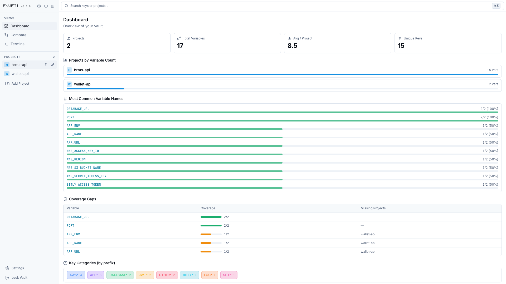
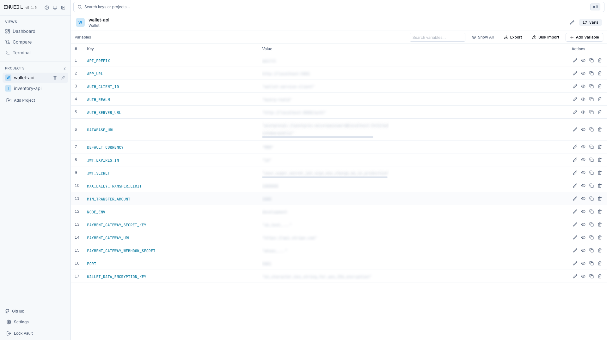
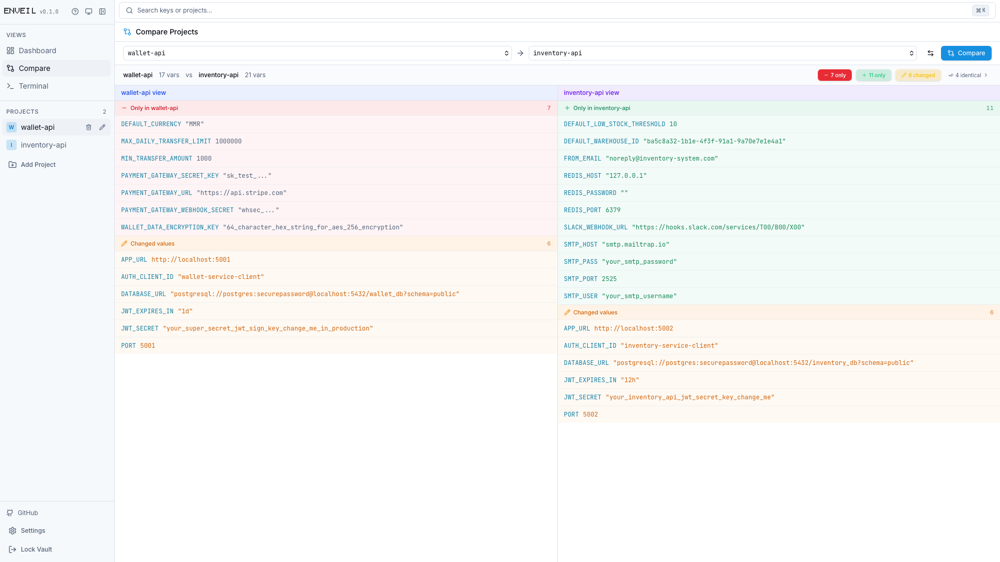
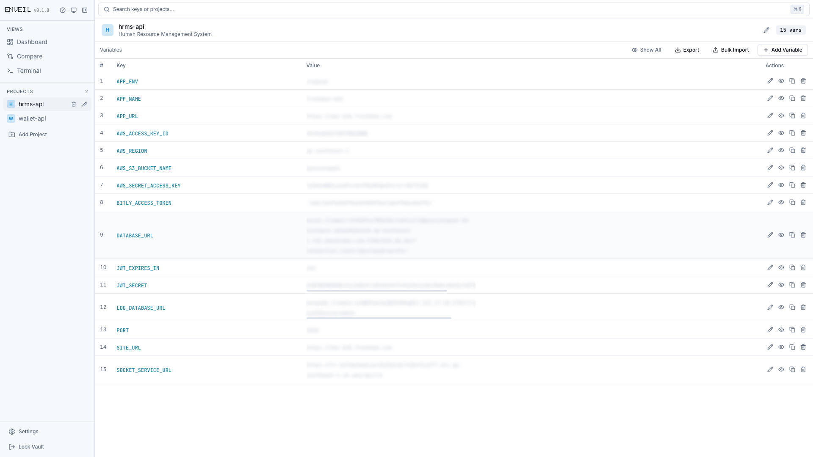
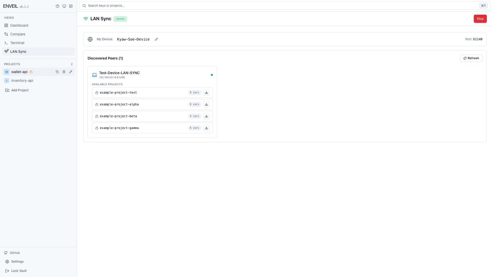
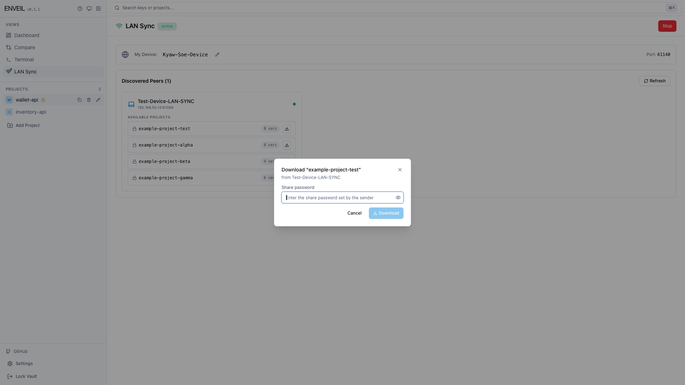
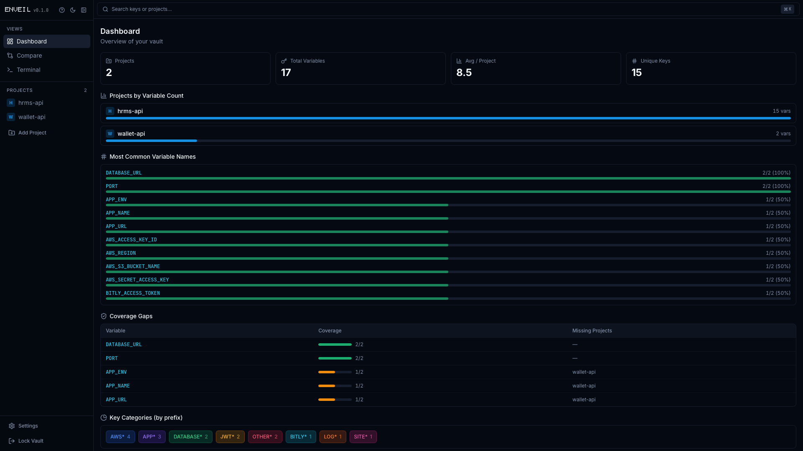
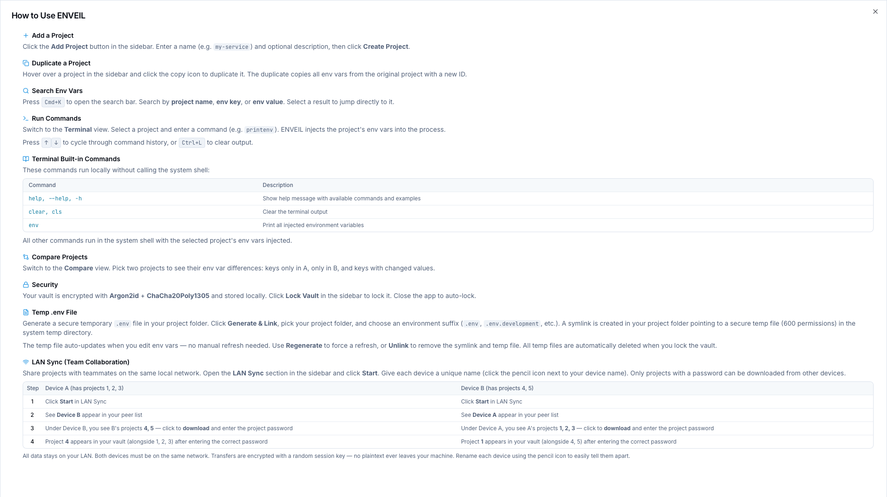

# ENVEIL — Centralized .env & Secret Vault

A desktop application for securely managing environment variables and secrets across multiple projects. Built with **Tauri v1** (Rust backend) + **Next.js 14** (TypeScript frontend).

<p align="center">
  <a href="https://github.com/kyawsoe-dev/enveil/releases/latest">
    
  </a>
  <a href="https://github.com/kyawsoe-dev/enveil/releases/latest">
    
  </a>
  <a href="https://github.com/kyawsoe-dev/enveil/releases/latest">
    
  </a>
</p>

## Download

Grab the latest installer for your platform from the [releases page](https://github.com/kyawsoe-dev/enveil/releases/latest) (`.dmg` for macOS, `.msi` for Windows, `.deb` for Linux).

### macOS Troubleshooting

If macOS blocks the app from opening (unverified developer), run this in Terminal:

```bash
xattr -cr /Applications/ENVEIL.app
```

This removes the quarantine attribute. Then open the app normally.

## Screenshots

| Dashboard | Env Table | Diff View | Terminal Runner |
|---|---|---|---|
|  |  |  |  |
| **LAN Sync** | **LAN Download** | **Settings** | **Usage Guide** |
|  |  |  |  |

## Features

| Feature | Description |
|---|---|
| **Encrypted Vault** | Master password → Argon2id → ChaCha20Poly1305 encrypted `vault.bin` on disk |
| **Project CRUD** | Create, edit, rename, delete projects (each with a key-value env map) |
| **Inline Env Editing** | Add, edit, bulk import, and delete env vars per project |
| **Export** | Export project env vars as `.env` file via native Tauri save dialog |
| **Project Diff** | Side-by-side comparison of any two projects (keys only in A / only in B / changed) |
| **Terminal Runner** | Run shell commands with decrypted env vars injected scoped to the child process |
| **Dashboard Analytics** | Stats cards + bar chart ranking projects by env var count |
| **Search** | Cmd+K search across project names, env keys, and env values |
| **Change Password** | Re-encrypts entire vault with a new master password |
| **Auto-Lock** | Lock vault after configurable inactivity timeout |
| **Reset Vault** | Securely wipe the entire vault and all projects |
| **LAN Sync** | Share projects with teammates on the same local network with per-project share passwords for download authorization |
| **Dark/Light/System Theme** | Class-based theming via `next-themes` |
| **Project Duplicate** | Duplicate existing projects to create copies with shared env vars |

## Architecture

```
┌──────────────────────────────────┐
│         Frontend (Next.js)       │
│  ┌─────────┐ ┌────────────────┐  │
│  │ Sidebar │ │ Dashboard /    │  │
│  │ (nav)   │ │ DiffView /     │  │
│  │         │ │ TerminalRunner │  │
│  └─────────┘ └────────────────┘  │
│  ┌────────────────────────────┐  │
│  │   VaultProvider (context)  │  │
│  └────────────────────────────┘  │
└──────────────┬───────────────────┘
               │ IPC (tauri::invoke)
┌──────────────▼───────────────────┐
│         Rust Core (Tauri)        │
│  ┌────────────────────────────┐  │
│  │  17 tauri::commands          │  │
│  └──────────┬─────────────────┘  │
│  ┌──────────▼─────────────────┐  │
│  │  Vault in memory (plain)   │  │
│  │  ┌──────────────────────┐  │  │
│  │  │ Argon2id → Key       │  │  │
│  │  │ ChaCha20Poly1305     │  │  │
│  │  └──────────────────────┘  │  │
│  └──────────┬─────────────────┘  │
│  ┌──────────▼─────────────────┐  │
│  │  vault.bin (disk, enc.)    │  │
│  └────────────────────────────┘  │
└──────────────────────────────────┘
```

## Flow Chart


## Project Structure

```
├── desktop/                          Next.js 14 frontend
│   ├── src/
│   │   ├── app/
│   │   │   ├── layout.tsx            Root layout, metadata, font loading
│   │   │   ├── page.tsx              AppShell (sidebar + content routing)
│   │   │   └── globals.css           Tailwind base + custom CSS vars
│   │   ├── components/
│   │   │   ├── ui/                   shadcn-style primitives
│   │   │   │   ├── badge.tsx, button.tsx, card.tsx, dialog.tsx
│   │   │   │   ├── input.tsx, separator.tsx, toast.tsx, toaster.tsx
│   │   │   ├── AppBrand.tsx          Logo/wordmark component
│   │   │   ├── ChangePasswordDialog.tsx
│   │   │   ├── Dashboard.tsx         Analytics + env table view
│   │   │   ├── DeleteProjectDialog.tsx  Delete project confirmation
│   │   │   ├── DiffView.tsx          Side-by-side project comparison
│   │   │   ├── EditProjectDialog.tsx Add/edit project dialog
│   │   │   ├── EnvTable.tsx          Inline env var editing + bulk import + export
│   │   │   ├── MasterAuth.tsx        Login/create vault screen
│   │   │   ├── ProjectView.tsx       Selected project detail view
│   │   │   ├── ResetVaultDialog.tsx  Wipe vault confirmation
│   │   │   ├── SearchBar.tsx         Cmd+K search across all data
│   │   │   ├── SettingsDialog.tsx    Vault settings (auto-lock, security)
│   │   │   ├── Sidebar.tsx           Project list + collapse + theme toggle
│   │   │   ├── TerminalRunner.tsx    Shell command runner with env injection
│   │   │   ├── ThemeProvider.tsx     next-themes wrapper
│   │   │   ├── UsageGuide.tsx        Help modal
│   │   │   └── VaultProvider.tsx     React context (state + dispatch)
│   │   ├── lib/
│   │   │   ├── brand.ts              App name, logo paths, brand font class
│   │   │   ├── tauri.ts              invoke wrappers (17 commands)
│   │   │   ├── types.ts              TS interfaces (Vault, Project, DiffResult…)
│   │   │   └── utils.ts              cn() helper
│   │   ├── global.d.ts               *.css module declaration
│   │   └── hooks/
│   │       └── use-toast.ts          Toast notification hook
│   ├── tailwind.config.ts            Fonts (Bitcount Single, Inter, JetBrains Mono)
│   └── package.json                  Dependencies (next, react, tauri, tailwind…)
│
├── src-tauri/                        Rust backend
│   ├── src/
│   │   ├── main.rs                   Tauri builder, state, handler registration
│   │   ├── error.rs                  VaultError enum
│   │   ├── models/
│   │   │   ├── vault.rs              Vault, Project, SecurePayload
│   │   │   └── diff.rs               DiffResult + diff_projects()
│   │   ├── network/
│   │   │   ├── discovery.rs          mDNS service discovery
│   │   │   ├── transport.rs          Encrypted transfer over TCP
│   │   │   └── types.rs              PeerInfo, ProjectSummary, SyncState
│   │   ├── crypto/
│   │   │   ├── key_derivation.rs     Argon2id → 32-byte key
│   │   │   └── encryption.rs         ChaCha20Poly1305 encrypt/decrypt
│   │   ├── storage/
│   │   │   └── vault_file.rs         Save/load encrypted vault file
│   │   ├── commands/
│   │   │   │   ├── vault_commands.rs     Vault commands (unlock, save, delete…)
│   │   │   │   └── sync_commands.rs      LAN sync commands (start, stop, download)
│   ├── tauri.conf.json               Window config (fullscreen), allowlist, icons
│   └── Cargo.toml                    Rust dependencies
│
└── README.md                         This file
```

## Security

| Measure | Implementation |
|---|---|
| **Key Derivation** | Argon2id (64 MB memory, 3 iterations, 4 parallelism) |
| **Encryption** | ChaCha20Poly1305 — authenticated encryption with 192-bit nonce |
| **Storage** | Encrypted `vault.bin` in OS config directory (`~/.config/env-vault/`) |
| **Memory** | Plaintext vault held only in process memory after unlock |
| **Process Isolation** | Injected env vars scoped to child process — never written to global environment |
| **Error handling** | All Tauri commands return `Result<T, String>`; internal errors propagate via `VaultError` |

## IPC Commands

All commands return `Result<T, String>` for frontend consumption.

| Command | Args | Returns |
|---|---|---|
| `initialize_vault` | `password: String` | `()` |
| `unlock_vault` | `password: String` | `Vault` |
| `save_project` | `password: String, project: Project` | `()` |
| `delete_project` | `password: String, project_id: String` | `()` |
| `diff_projects` | `project_a_id: String, project_b_id: String` | `DiffResult` |
| `run_command` | `command: String, project_id: String` | `String` (stdout + stderr) |
| `vault_exists` | — | `bool` |
| `change_password` | `old_password: String, new_password: String` | `()` |
| `get_vault` | — | `Option<Vault>` |
| `reset_vault` | — | `()` |
| `start_lan_sync` | — | `()` |
| `stop_lan_sync` | — | `()` |
| `get_sync_status` | — | `SyncState` |
| `get_peers` | — | `Vec<PeerInfo>` |
| `get_peer_projects` | `peerDeviceName: String` | `Vec<ProjectSummary>` |
| `sync_project_from_peer` | `peerDeviceName: String, projectId: String, password: String, sharePassword: String` | `Project` |
| `set_device_name` | `name: String` | `()` |

## Data Models

```rust
pub struct Vault {
    pub version: u32,
    pub projects: Vec<Project>,
}

pub struct Project {
    pub id: String,
    pub name: String,
    pub description: String,
    pub env_vars: BTreeMap<String, String>,
    pub share_password: Option<String>,  // Optional password for LAN sync downloads
}

pub struct SecurePayload {
    pub salt: Vec<u8>,       // 32 bytes
    pub nonce: Vec<u8>,      // 12 bytes
    pub ciphertext: Vec<u8>,
}

pub struct DiffResult {
    pub project_a_name: String,
    pub project_b_name: String,
    pub only_in_a: BTreeMap<String, String>,
    pub only_in_b: BTreeMap<String, String>,
    pub changed: BTreeMap<String, (String, String)>,
}
```

## Typography

| Usage | Font |
|---|---|
| Brand (logo) | **Bitcount Single** |
| UI / system | **Inter** |
| Code / env values | **JetBrains Mono** |

Loaded via `<link>` + `<style>` in `layout.tsx` (not CSS `@import` to avoid PostCSS ordering issues).

## Development

```bash
# Prerequisites: Rust, Node.js, Tauri CLI

# Install frontend dependencies
cd desktop && npm install

# Run Tauri dev server (starts Next.js dev + Tauri window)
cargo tauri dev
```

The frontend is a static Next.js export (`next build`, output in `desktop/out/`). Tauri loads `../desktop/out/index.html` as the webview source.

## Rust Dependencies

| Crate | Purpose |
|---|---|
| `tauri` v1 | Desktop shell, IPC bridge, fs/path/shell/dialog allowlist |
| `serde` / `serde_json` | Serialization |
| `argon2` 0.5 | Argon2id key derivation |
| `chacha20poly1305` 0.10 | Authenticated symmetric encryption |
| `directories` 5 | Cross-platform config directory |
| `uuid` 1 | Project identifiers |
| `thiserror` 1 | Error types |
| `rand` 0.8 | Salt & nonce generation |
| `mdns-sd` 0.13 | LAN service discovery via mDNS |

---

**Developer:** Kyaw Soe &nbsp;|&nbsp; **License:** MIT